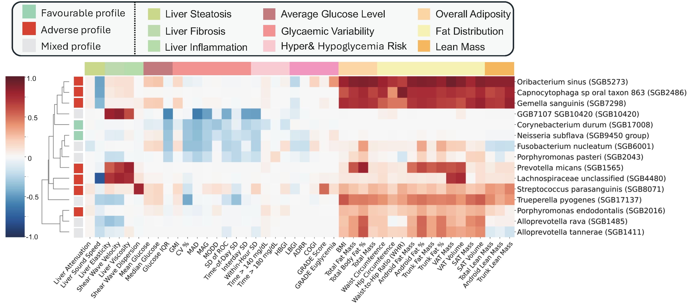
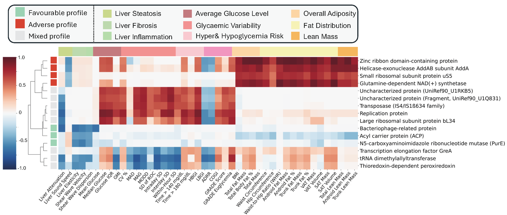
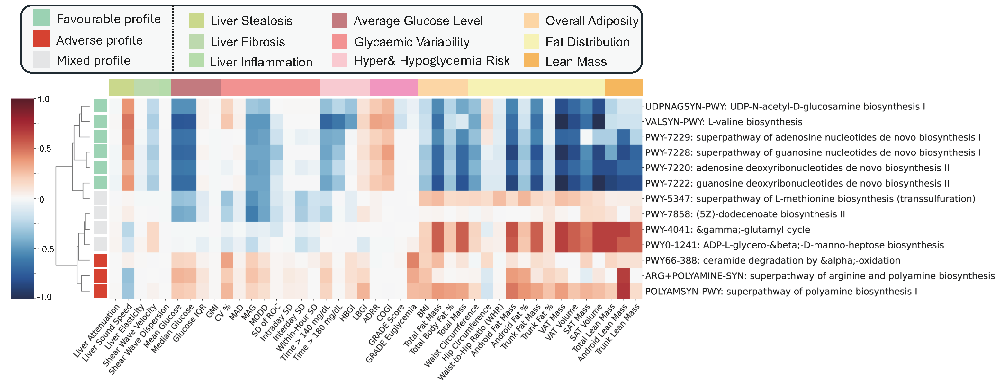
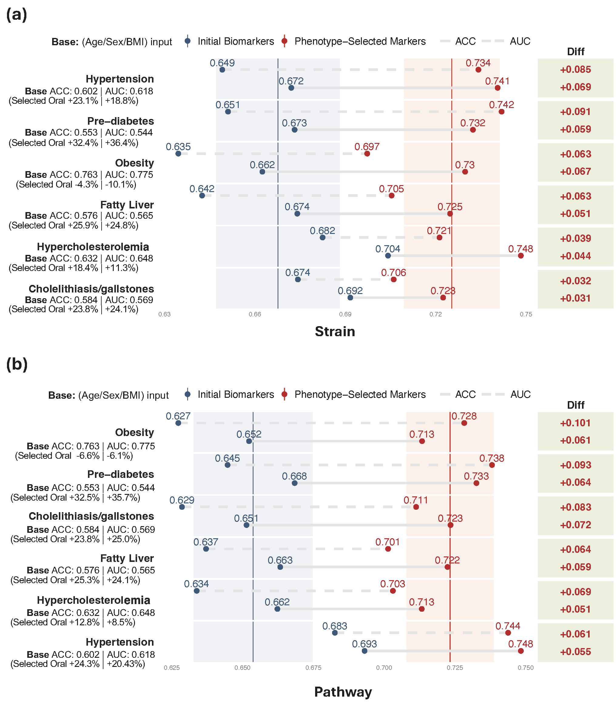

# 🧬 Oral Microbiome as a Window Into Metabolic Health

> Can a simple oral swab provide valuable insights into your liver health,
> glucose regulation, and body composition?
> We confidently answer **"yes"** — and at an unprecedented scale.

This repository contains code, analysis pipelines, and resources centered
on the **oral microbiome**, emphasizing large-scale, high-resolution studies
that link the oral microbiome to human health.


---

## 📋 Table of Contents

- [Roadmap](#-roadmap)
- [Why This Work Matters](#-why-this-work-matters)
- [Key Contributions](#-key-contributions)
- [Key Findings](#-key-findings)
- [Visual Overview](#-visual-overview)
- [Citation](#-citation)

---

## 🚀 Roadmap

Our goal is to systematically elucidate the role of the oral microbiome
in systemic diseases. Utilizing a **microbiome-wide association study (MWAS)**
framework, we have developed a comprehensive multi-layer map that encompasses:

| Component               | Detail                                                                 |
|------------------------|------------------------------------------------------------------------|
| **Cohort**             | 9,431 participants from the Human Phenotype Project (HPP)              |
| **Phenotyping Depth**  | 44 metabolic traits (Liver ultrasound, CGM, DXA body composition)      |
| **Microbiome Layers**  | Strain-level · Gene-family level · Pathway level                       |
| **Output**             | Oral microbiome–metabolism association atlas                           |

We integrate **whole-metagenome oral microbiome data** with
**in-depth metabolic phenotyping** to uncover microbial signatures linked
to metabolic traits across various physiological systems.

---

## 💡 Why This Work Matters

Many microbiome studies are constrained by either **small sample sizes**
or **low-resolution profiling**. In contrast, our work:

- ✅ Merges **population-scale data** with **whole-metagenome resolution**
- ✅ Integrates **multi-system metabolic phenotyping**
- ✅ Facilitates discovery of **both system-specific and cross-phenotype
  microbial signals**

> This establishes a **new reference framework** for investigating the oral
> microbiome's role in human health and disease.

---

## 🧠 Key Contributions

### 1. Population-Scale, High-Resolution Microbiome Profiling

We analyze standardized bilateral buccal-swab whole-metagenome data from
**9,431 individuals**, complemented by rich metabolic phenotypes.

### 2. A Unified Multi-Layer MWAS Framework

We present a robust framework for testing associations across:

- Strains
- Gene families
- Pathways

Employing covariate-adjusted models and **layer-specific multiple testing
control**.

### 3. Translational and Validated Outputs

- A comprehensive **multi-system association atlas**
- Identification of **cross-phenotype microbial markers**
- Demonstration of **metabolic disease classification**
- **External validation** in an independent cohort

---

## 🔬 Key Findings

### Association Summary

| Molecular Layer     | Significant Associations |
|--------------------|--------------------------|
| Strains             | 213                      |
| Gene Families       | 124,603                  |
| Pathways            | 299                      |

### Signal Enrichment

- **Strain-level signals** → enriched for **body composition traits**
- **Functional signals** (genes & pathways) → enriched for
  **glucose regulation** (CGM-derived phenotypes)

### Disease Prediction

Oral microbiome features enhance prediction of:

- 🫀 Hypertension
- 🩸 Pre-diabetes
- ⚖️ Obesity
- 🫁 Fatty liver
- 🧪 Hypercholesterolemia
- 🪨 Gallstones

### Replication

> Key BMI and waist-related signals **replicate directionally** in an
> independent cohort of **20,293 individuals**.

---

## 🖼️ Visual Overview

### Figure 1 — Study Design and Global Association Landscape

<div align="center">
  
</div>

**Highlights:**
- Cohort design and sampling alignment
- Integration of microbiome and multi-system phenotypes
- Global association counts across all molecular layers

---

### Figure 2 — Core Strain-Level Associations

<div align="center">
  
</div>

Representative oral strains demonstrating:
- Favorable metabolic associations
- Adverse associations
- Mixed phenotype effects

---

### Figure 3 — Gene-Family Signatures

<div align="center">
  
</div>

Key microbial gene families associated with:
- Biosynthesis
- Replication
- Stress response
- Metabolic regulation

---

### Figure 4 — Pathway-Level Insights

<div align="center">
  
</div>

Biologically interpretable pathways, including:
- Favorable biosynthetic programs
- Adverse pathways:
  - Polyamine biosynthesis
  - Ceramide-related metabolism

---

### Figure 5 — Disease Classification Performance

<div align="center">
  
</div>

Oral microbiome features significantly enhance prediction across multiple
metabolic diseases, underscoring their **clinical and translational potential**.

---

## 📄 Citation

If you use this code or findings in your research, please cite:

```bibtex
@article{xue2023oral,
  title     = {Decoding the Oral Microbiome: Metagenomic Insights
               into Host Metabolic Health},
  author    = {Xue, Haochen and Godneva, Anastasia and Tang, Feilong
               and Li, Huifa and Li, Yulong and Hu, Ming and Li, Ruobing
               and Su, Jionglong and Segal, Eran and Razzak, Imran},
  journal   = {Nature Communications},
  year      = {2023},

}


